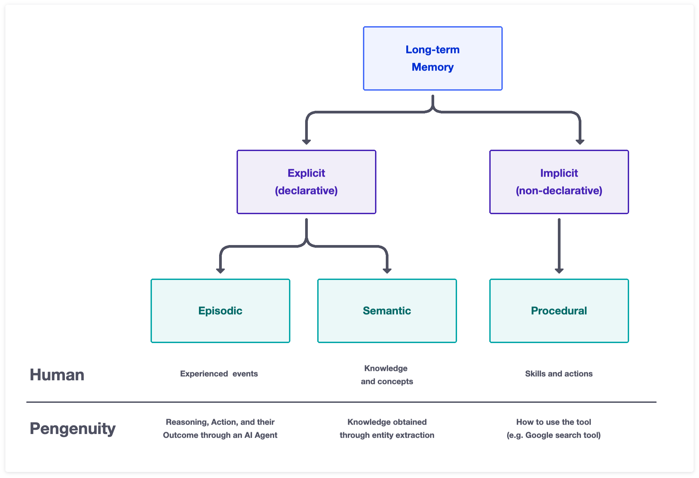

# Pixel Labs: ReAct Agent with Human-Like Memory System

[](https://x.com/labs_pixel)


Pixel Labs is an experimental open-source autonomous AI Agent that aims to replicate the structure of human memory. The project's ultimate goal is to create an AI agent that can learn and reason like a human, with the hope of better understanding the nature of human cognition.

Visit our website at [pixellabs.cx](https://pixellabs.cx)

## ✔️ Features

Pixel Labs is designed to have the following features:

- A memory structure that mimics human long-term memory:
  - Procedural memory for the storage and retrieval of tool usage procedures.
  - Semantic memory for the storage and retrieval of concepts and knowledge.
  - Episodic memory for the storage and retrieval of specific events or episodes.
- The ability to learn new concepts and remember task execution results while performing tasks.
- Use of tools based on procedural memory:
  - The built-in tools include only the default Google search tool for web browsing.
  - Customization of tools, allowing users to add and tailor tools to their specific needs and preferences.
- Designed to operate using GPT-3.5.
- Developed based on LangChain, making it compatible with the LangChain ecosystem.

## 🎬 Demo
https://user-images.githubusercontent.com/5876695/233595862-82f30fe0-c9dc-4b26-8c7c-76882b5ddec9.mov

## 🧠 Human-Like Memory System

Human long-term memory consists of three types: Procedural memory, Semantic memory, and Episodic memory.

- **Procedural memory** is the long-term memory related to the acquisition and execution of motor and cognitive skills, such as riding a bicycle, typing on a keyboard, or playing a musical instrument.

- **Semantic memory** refers to long-term memory of facts, concepts, and general knowledge about the world, such as knowing that the capital of France is Paris or that the sun rises in the east and sets in the west.

- **Episodic memory** is the long-term memory responsible for remembering specific events or personal experiences. It allows us to remember past experiences and to relive them in our minds, such as a family vacation or a significant life event.



Pixel Labs' memory structure is based on human long-term memory and consists of three vector stores:

- **Procedural memory vector store**: stores and retrieves tool usage procedures. It saves information about external tools specified by the user.
- **Semantic memory vector store**: stores and retrieves concepts and knowledge. It saves the knowledge obtained through entity extraction.
- **Episodic memory vector store**: stores and retrieves specific events or episodes. It saves the sequence of the agent's actions.


## 🚗 How It Works


This script operates in the following loop:

1. The agent generates a task list based on the goal provided by the user.
2. The agent searches for memories related to the current task, looking for relevant concepts and past reasoning and action results.
3. Based on the search results, it determines the next action to take.
4. It executes the action using external tools.
5. It performs entity extraction on the execution results, learning new concepts and storing reasoning and actions and their results as an episode in memory.
6. It returns to step 2.

## 🔧 Installation

To install Pixel Labs, follow these steps:

1. Clone the repository:

```bash
git clone https://github.com/dory111111/Pixel-Labs.git
```

2. Navigate to the directory where the repository was downloaded

```bash
cd Pixel-Labs
```

3. Install the required dependencies using poetry:

```bash
poetry install
```

4. Rename `.env.sample` to `.env` 

5. Open the `.env`  file and fill in the following variables:
   - `OPENAI_API_KEY` : Your OpenAI API key.
   - `GOOGLE_API_KEY` : Your Google API key.
   - `GOOGLE_CSE_ID` : Your Google Custom Search Engine ID.

## 💻 Usage

1. Run `Pixel Labs` Python module in your terminal

```bash
poetry run python src/main.py
```

## 🚀 Planned Features

- LangChain's Tools and ChatGPT plugin as part of Pixel Labs' Tool.
- Local LLM support
- Code Refactoring
- Vector Store compatibility
- Alternative User Interface

## 🤖 Supported Models<a name="supported-models"></a>

The default model is **gpt-3.5-turbo**. To use a different model, specify it through `OPENAI_API_MODEL` or use the command line. GPT-4 and LLaMA compatibility testing is currently not being conducted.

## 🛠 Acknowledgments

I would like to express my gratitude to the developers whose code I referenced in creating this repo.

Special thanks go to:

- BabyAGI @yoheinakajima (https://github.com/yoheinakajima/babyagi)
- Auto-GPT @Significant-Gravitas (https://github.com/Significant-Gravitas/Auto-GPT)
